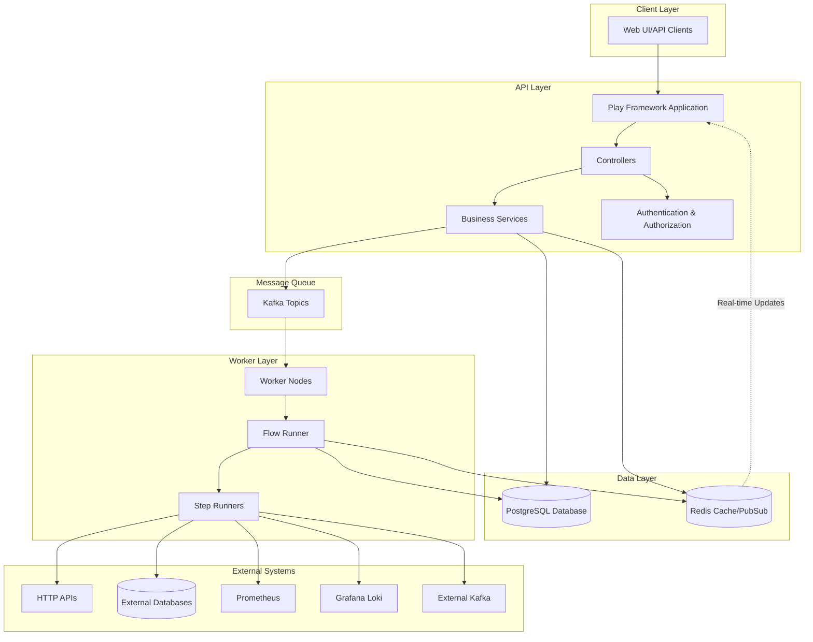
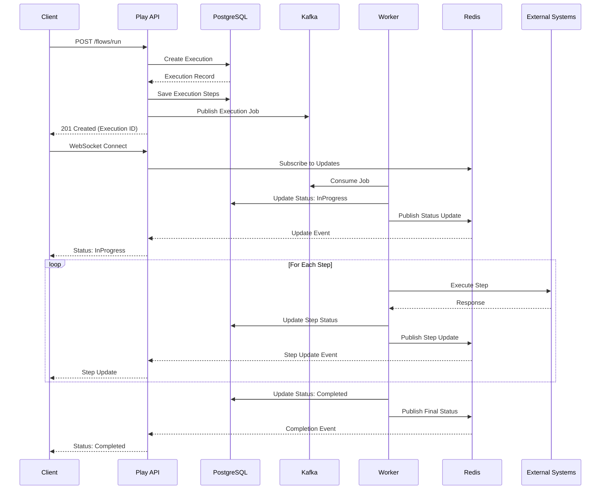
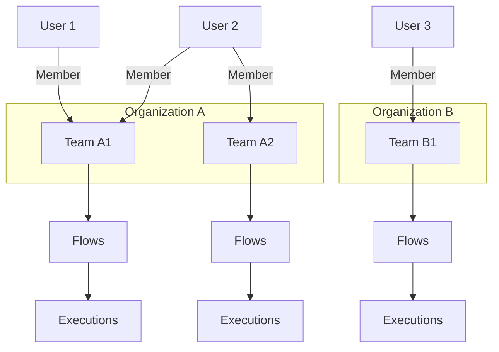
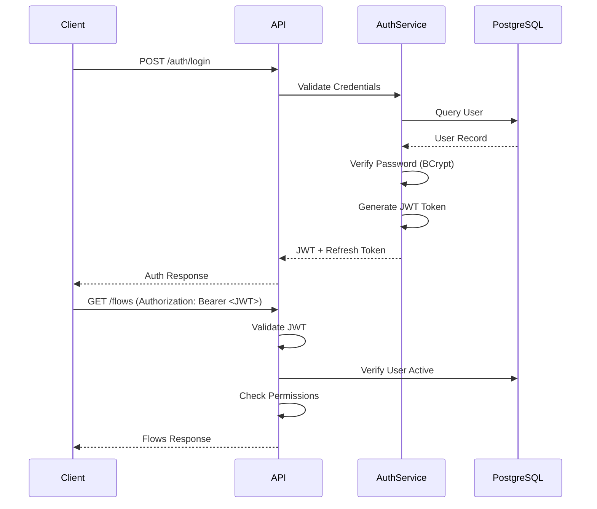
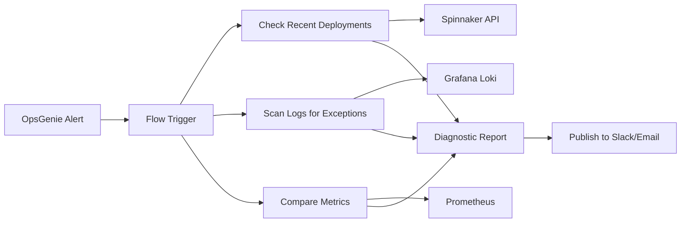
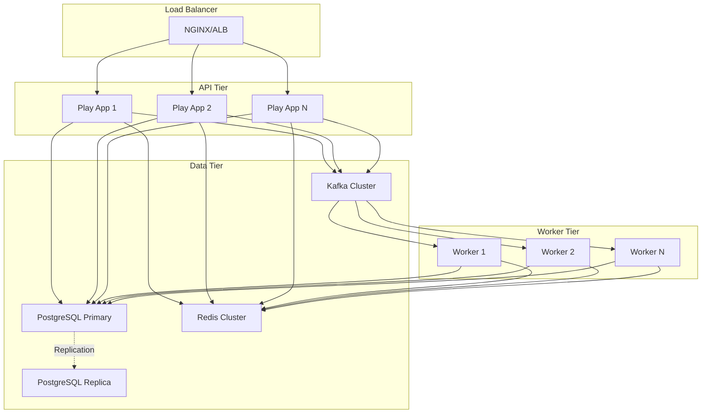

# High-Level Design (HLD) - Async Testing Service

## 1. Overview

The Async Testing Service is a distributed, event-driven platform for orchestrating and executing complex asynchronous workflows. It enables users to define, execute, and monitor multi-step test flows across various systems including HTTP APIs, databases, message queues, and observability platforms.

### Key Capabilities
- **Multi-step Flow Orchestration**: Define complex workflows with sequential and parallel execution
- **Asynchronous Execution**: Non-blocking execution with real-time progress streaming
- **Multi-tenancy**: Organization and team-based isolation
- **Observability Integration**: Native integration with Prometheus, Grafana Loki, and other monitoring tools
- **Event-driven Architecture**: Kafka-based job distribution and Redis-based real-time updates

---

## 2. System Architecture

---

## 3. Core Components

### 3.1 Play Framework Application (API Server)

**Responsibilities:**
- REST API exposure for flow/execution management
- User authentication and authorization (JWT-based)
- WebSocket endpoints for real-time execution updates
- Request validation and error handling

**Key Controllers:**
- `AuthController`: User authentication
- `FlowsController`: Flow CRUD operations
- `ExecutionController`: Execution management and streaming
- `TestSuiteController`: Test suite management
- `ResourceController`: External resource configuration
- `OrganisationsController`, `TeamsController`: Multi-tenancy

### 3.2 Worker Application

**Responsibilities:**
- Consume execution jobs from Kafka
- Execute flows step-by-step
- Publish real-time updates via Redis
- Handle retries and error recovery

**Key Components:**
- `FlowRunner`: Orchestrates step execution
- `StepRunnerRegistry`: Maps step types to implementations
- Step Runners:
  - `HttpStepRunner`: HTTP requests
  - `SqlStepRunner`: Database queries
  - `KafkaPublisherStepRunner`, `KafkaConsumerStepRunner`: Kafka operations
  - `RedisStepRunner`: Redis operations
  - `DelayStepRunner`: Timed delays
  - `LokiStepRunner`: (New) Grafana Loki log queries
  - `PrometheusStepRunner`: (New) Prometheus metric queries

### 3.3 Data Layer

**PostgreSQL Database:**
- Schema managed via Flyway migrations
- Tables:
  - `user_auth`, `user_profiles`: User management
  - `organisations`, `teams`: Multi-tenancy
  - `flows`, `flow_versions`: Flow definitions
  - `executions`, `execution_steps`: Execution state
  - `test_suites`, `test_suite_executions`: Test suite management
  - `resources`: External system configurations

**Redis:**
- Real-time execution updates (Pub/Sub)
- Distributed caching
- Session management

### 3.4 Message Queue (Kafka)

**Topics:**
- `worker-queue-topic`: Execution job distribution
- Custom topics for user-defined workflows

---

## 4. Data Flow - Flow Execution

---

## 5. Multi-tenancy Architecture

**Isolation:**
- Data isolated by `orgId` and `teamId`
- Row-level security via query filters
- Users can belong to multiple teams/organizations

---

## 6. Security Architecture

### Authentication Flow

**Security Features:**
- JWT-based authentication
- BCrypt password hashing
- Role-based access control (RBAC)
- Permission-based authorization
- Token refresh mechanism
- Secure password reset flow

---

## 7. Observability & Monitoring

### Metrics (Prometheus)
- Execution metrics: count, duration, success/failure rate
- Step-level metrics
- API request metrics
- Worker health metrics

### Logging
- Structured logging (JSON format)
- Log levels: DEBUG, INFO, WARN, ERROR
- Correlation IDs for request tracing

### Real-time Monitoring
- WebSocket-based execution streaming
- Redis Pub/Sub for live updates
- Execution state tracking

---

## 8. Scalability Considerations

### Horizontal Scaling
- **API Layer**: Stateless design, can scale horizontally
- **Worker Layer**: Kafka consumer groups for parallel processing
- **Database**: Connection pooling (HikariCP)

### Performance Optimizations
- Async/non-blocking execution (Akka Streams)
- Database query optimization (indexed columns)
- Redis caching for frequently accessed data
- Kafka partitioning for workload distribution

---

## 9. Future Enhancements

### OnCall Automation Platform
Integration with incident management systems for automated diagnostics:

**Planned Integrations:**
- OpsGenie: Alert triggering
- Spinnaker: Deployment history
- PagerDuty: Incident correlation
- Slack/Email: Report distribution
- AI/ML: Anomaly detection and root cause analysis

---

## 10. Technology Stack

| Layer | Technology |
|-------|-----------|
| **API Framework** | Play Framework 2.9 (Scala) |
| **Database** | PostgreSQL 14+ |
| **Cache/PubSub** | Redis 6+ |
| **Message Queue** | Apache Kafka 3.x |
| **ORM** | Slick 3.4 |
| **Migration** | Flyway 11 |
| **Async Runtime** | Akka Streams 2.6 |
| **Auth** | JWT (jwt-scala), BCrypt |
| **Metrics** | Prometheus Client |
| **HTTP Client** | Play WS |
| **Build Tool** | sbt 1.10 |
| **Container** | Docker (Alpine Linux) |

---

## 11. Deployment Architecture

**Deployment Characteristics:**
- Containerized deployment (Docker)
- Kubernetes orchestration (future)
- Blue-green deployment support
- Health checks and readiness probes
- Graceful shutdown handling

