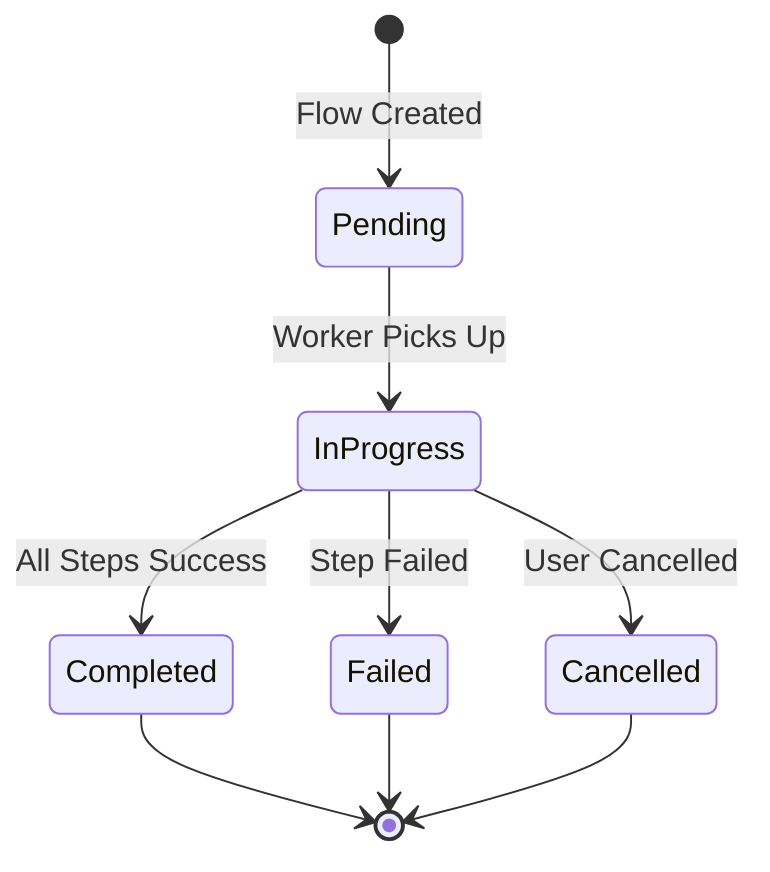
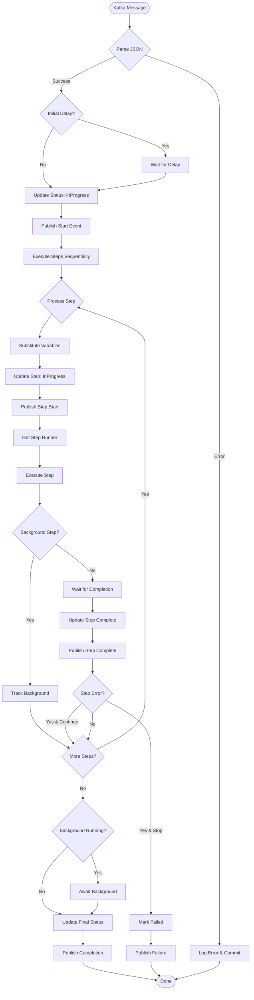
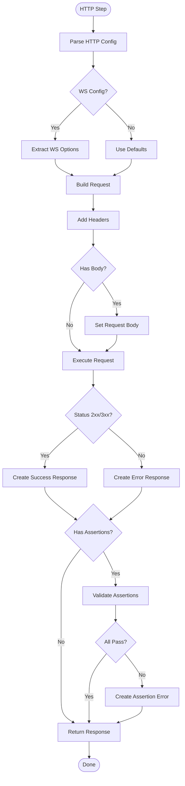
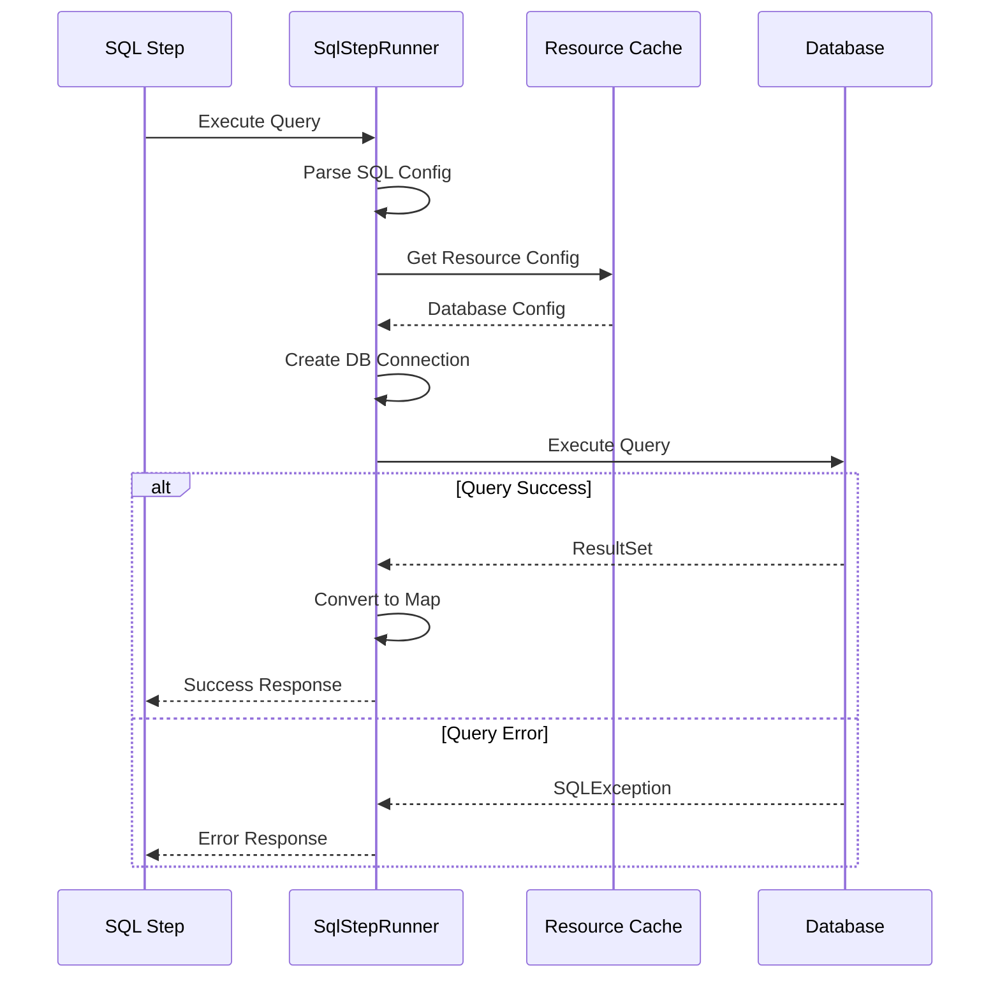
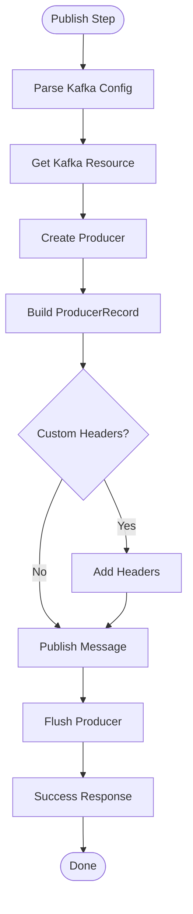
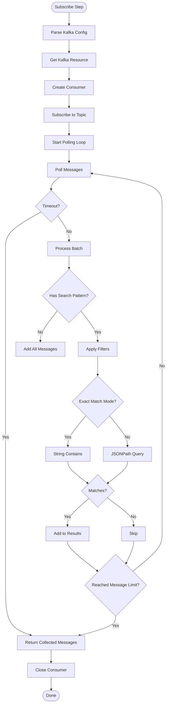
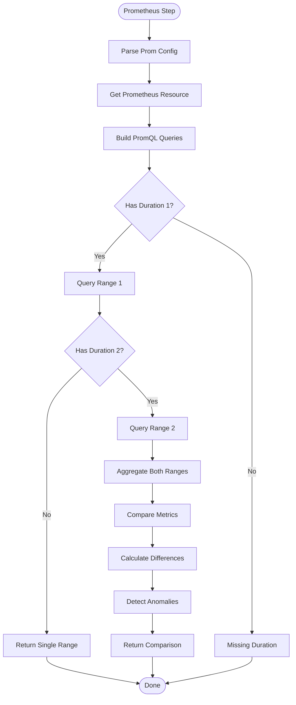
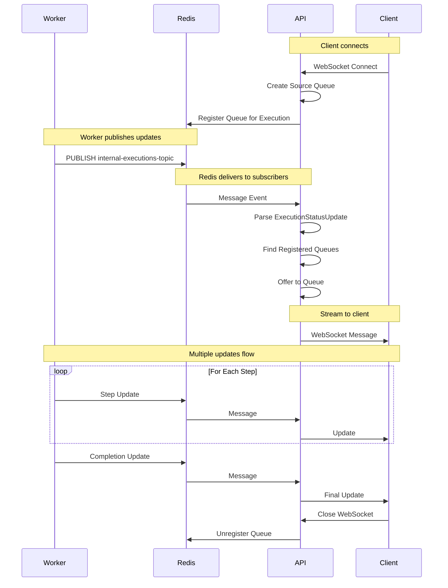
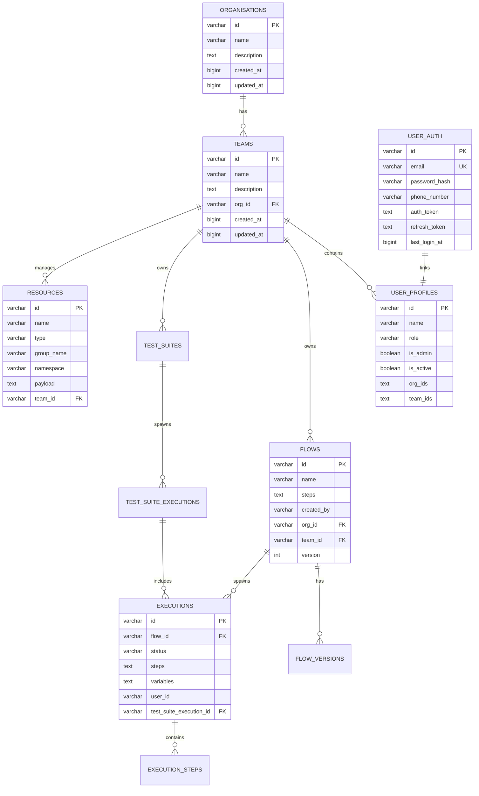
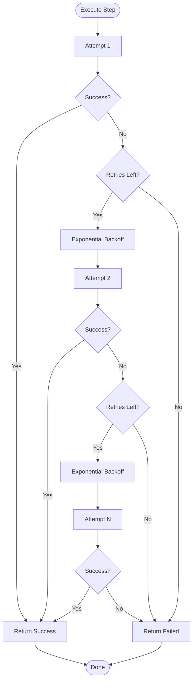

# Low-Level Design (LLD) - Async Testing Service

## 1. Flow Execution Engine - Detailed Design

### 1.1 Flow Execution Lifecycle



### 1.2 FlowRunner Implementation

The `FlowRunner` is the core orchestration engine that executes flows step-by-step.

**Class Structure:**
```scala
class FlowRunnerImpl(
  executionRepository: ExecutionRepository,
  stepRunnerRegistry: StepRunnerRegistry,
  redisClient: RedisClient,
  configuration: Configuration,
  testSuiteExecutionRepository: TestSuiteExecutionRepository
)
```

**Execution Flow:**



**Key Methods:**

1. **startFlowConsumer()**
   - Subscribes to Kafka topic
   - Processes messages asynchronously (parallelism: 10)
   - Handles initial delays
   - Commits offset after processing

2. **executeFlow(execution: Execution)**
   - Updates execution status to InProgress
   - Calls `executeFlowSteps()`
   - Handles final status update (Completed/Failed)
   - Publishes execution completion

3. **executeFlowSteps(executionId, steps, variables)**
   - Maintains step results map
   - Tracks background steps separately
   - Processes steps sequentially
   - Applies variable substitution
   - Handles errors with `continueOnSuccess` flag

**Variable Substitution:**
```scala
// Steps can reference previous step outputs:
// ${stepName.response.field}
// ${stepName.response.body.jsonPath}

RuntimeVariableSubstitution.substituteVariablesInSteps(
  steps: List[FlowStep],
  variables: List[VariableValue]
)
```

---

## 2. Step Runner Architecture

### 2.1 Step Runner Interface

```scala
trait StepRunner {
  def runStep(
    step: ExecutionStep,
    previousResults: List[StepResponse]
  ): Future[StepResponse]
}
```

### 2.2 Base Step Runner

```scala
abstract class BaseStepRunner extends StepRunner {
  protected def variableSubstitutionService: VariableSubstitutionService
  protected val runnerName: String
  
  override def runStep(step: ExecutionStep, previousResults: List[StepResponse]): Future[StepResponse] = {
    // 1. Apply variable substitution
    // 2. Execute step
    // 3. Handle timeout (if not background)
    // 4. Return response
  }
  
  protected def executeStep(step: ExecutionStep, previousResults: List[StepResponse]): Future[StepResponse]
}
```

### 2.3 HTTP Step Runner

**Flow Diagram:**



**Configuration:**
```scala
case class HttpStepConfig(
  url: String,
  method: String,              // GET, POST, PUT, DELETE, etc.
  headers: Map[String, String],
  body: Option[String],
  timeout: Option[Int],
  followRedirects: Option[Boolean],
  assertions: Option[List[HttpAssertion]]
)

case class HttpAssertion(
  field: String,              // "status", "body.data.id", "headers.content-type"
  operator: String,           // "equals", "contains", "matches", "gt", "lt"
  expectedValue: String
)
```

---

### 2.4 SQL Step Runner

**Query Execution Flow:**



**Configuration:**
```scala
case class SqlStepConfig(
  resourceId: String,          // Reference to resource configuration
  query: String,
  parameters: Option[Map[String, String]],
  maxRows: Option[Int] = Some(1000)
)

case class SqlResponse(
  rows: List[Map[String, String]],
  rowCount: Int,
  columns: List[String],
  executionTimeMs: Long
) extends StepResponseValue
```

---

### 2.5 Kafka Step Runners

#### A. Kafka Publisher



**Configuration:**
```scala
case class KafkaPublishConfig(
  resourceId: String,
  topic: String,
  message: String,
  key: Option[String],
  headers: Option[Map[String, String]],
  partition: Option[Int]
)
```

#### B. Kafka Consumer (Message Search Enhancement)



**Enhanced Configuration:**
```scala
case class KafkaSubscribeConfig(
  resourceId: String,
  topic: String,
  consumerGroup: String,
  messageLimit: Int = 100,
  timeoutMs: Int = 30000,
  searchPattern: Option[KafkaSearchPattern] = None  // NEW
)

case class KafkaSearchPattern(
  matchType: String,           // "exact" or "jsonpath"
  pattern: String,             // Search string or JSONPath expression
  matchAll: Boolean = false    // Return all matches vs first match
)
```

---

### 2.6 NEW: Loki Step Runner

**Log Query Flow:**

```mermaid
flowchart TD
    Start([Loki Step]) --> ParseConfig[Parse Loki Config]
    ParseConfig --> GetResource[Get Loki Resource]
    GetResource --> BuildQuery[Build LogQL Query]
    
    BuildQuery --> AddFilters{Has Label Filters?}
    AddFilters -->|Yes| AppendFilters[Add Label Selectors]
    AddFilters -->|No| AddTimeRange[Set Time Range]
    AppendFilters --> AddTimeRange
    
    AddTimeRange --> AddLineFilters{Has Line Filters?}
    AddLineFilters -->|Yes| AppendLineFilters[Add |= and != filters]
    AddLineFilters -->|No| ExecuteQuery[Execute Query]
    AppendLineFilters --> ExecuteQuery
    
    ExecuteQuery --> HTTPRequest[HTTP GET /loki/api/v1/query_range]
    HTTPRequest --> ParseResponse{Success?}
    
    ParseResponse -->|Yes| ExtractLogs[Extract Log Lines]
    ParseResponse -->|No| Error[Create Error Response]
    
    ExtractLogs --> ApplyContains{Has Contains Filters?}
    ApplyContains -->|Yes| FilterContains[Filter by Contains]
    ApplyContains -->|No| ApplyNotContains
    
    FilterContains --> ApplyNotContains{Has NotContains?}
    ApplyNotContains -->|Yes| FilterNotContains[Filter by NotContains]
    ApplyNotContains -->|No| ReturnLogs[Return Log Lines]
    
    FilterNotContains --> ReturnLogs
    Error --> ReturnLogs
    ReturnLogs --> End([Done])
```

**Configuration:**
```scala
case class LokiStepConfig(
  resourceId: String,
  namespace: String,           // e.g., "production", "staging"
  startTime: Long,             // Unix timestamp in milliseconds
  endTime: Long,
  labels: Map[String, String], // e.g., {"app": "api-service", "env": "prod"}
  containsPatterns: List[String] = List.empty,  // Must contain all
  notContainsPatterns: List[String] = List.empty, // Must not contain any
  limit: Int = 1000
)

case class LokiResource(
  id: Option[String],
  name: String,
  url: String,                 // e.g., "http://loki:3100"
  namespace: String,
  authToken: Option[String] = None
)

case class LokiResponse(
  logLines: List[LogEntry],
  matchCount: Int,
  scannedBytes: Long,
  executionTimeMs: Long
) extends StepResponseValue

case class LogEntry(
  timestamp: Long,
  line: String,
  labels: Map[String, String]
)
```

**Query Construction:**
```scala
// Example LogQL query construction:
// {namespace="production",app="api-service"} 
// |= "error" 
// |= "OutOfMemoryError" 
// != "test" 
// [start..end]

def buildLogQLQuery(config: LokiStepConfig): String = {
  val labelSelectors = config.labels.map { case (k, v) => 
    s"""$k="$v"""" 
  }.mkString(",")
  
  val baseQuery = s"{$labelSelectors}"
  
  val withContains = config.containsPatterns.foldLeft(baseQuery) { (query, pattern) =>
    s"""$query |= "$pattern""""
  }
  
  val withNotContains = config.notContainsPatterns.foldLeft(withContains) { (query, pattern) =>
    s"""$query != "$pattern""""
  }
  
  withNotContains
}
```

---

### 2.7 NEW: Prometheus Step Runner

**Metric Query Flow:**



**Configuration:**
```scala
case class PrometheusStepConfig(
  resourceId: String,
  query: String,               // PromQL query
  duration1: PrometheusDuration,
  duration2: Option[PrometheusDuration] = None, // For comparison
  step: String = "30s",        // Resolution
  aggregation: String = "avg"  // avg, max, min, sum
)

case class PrometheusDuration(
  startTime: Long,             // Unix timestamp
  endTime: Long
)

case class PrometheusResource(
  id: Option[String],
  name: String,
  url: String,                 // e.g., "http://prometheus:9090"
  authToken: Option[String] = None,
  timeout: Int = 30000
)

case class PrometheusResponse(
  duration1Results: MetricResult,
  duration2Results: Option[MetricResult] = None,
  comparison: Option[MetricComparison] = None,
  executionTimeMs: Long
) extends StepResponseValue

case class MetricResult(
  metric: String,
  values: List[MetricDataPoint],
  aggregatedValue: Double,
  min: Double,
  max: Double
)

case class MetricDataPoint(
  timestamp: Long,
  value: Double
)

case class MetricComparison(
  percentageChange: Double,
  absoluteDifference: Double,
  anomalyDetected: Boolean,
  anomalyReason: Option[String]
)
```

**Anomaly Detection Logic:**
```scala
def detectAnomaly(
  baseline: MetricResult,
  comparison: MetricResult,
  threshold: Double = 20.0  // 20% change threshold
): Boolean = {
  val percentChange = ((comparison.aggregatedValue - baseline.aggregatedValue) / 
                       baseline.aggregatedValue) * 100
  
  Math.abs(percentChange) > threshold
}
```

---

## 3. Real-time Update System

### 3.1 Redis Pub/Sub Architecture



### 3.2 Execution Status Update

```scala
case class ExecutionStatusUpdate(
  executionId: String,
  updateType: ExecutionUpdateType,
  stepUpdate: Option[StepUpdate],
  message: Option[String],
  executionStatus: ExecutionStatus
)

case class StepUpdate(
  stepId: String,
  status: StepStatus,
  response: Option[StepResponseValue]
)
```

---

## 4. Database Schema Design

### 4.1 Core Tables



### 4.2 Key Indexes

```sql
-- Performance-critical indexes
CREATE INDEX idx_executions_flow_id ON executions(flow_id);
CREATE INDEX idx_executions_status ON executions(status);
CREATE INDEX idx_executions_user_id ON executions(user_id);
CREATE INDEX idx_executions_created_at ON executions(created_at);

CREATE INDEX idx_flows_team_id ON flows(team_id);
CREATE INDEX idx_flows_created_by ON flows(created_by);

CREATE INDEX idx_resources_type ON resources(type);
CREATE INDEX idx_resources_team_id ON resources(team_id);
```

---

## 5. API Endpoint Specifications

### 5.1 Flow Execution Endpoint

**POST /api/v1/flows/run**

Request:
```json
{
  "flowId": "flow-123",
  "variables": [
    {
      "name": "base_url",
      "value": "https://api.example.com",
      "type": "string"
    }
  ],
  "parameters": {
    "initialDelay": "5000"
  }
}
```

Response (201 Created):
```json
{
  "id": "exec-456",
  "flowId": "flow-123",
  "status": "pending",
  "steps": [...],
  "createdAt": 1703721600000,
  "userId": "user-789"
}
```

### 5.2 WebSocket Execution Streaming

**WS /api/v1/executions/:id/stream**

Messages:
```json
{
  "executionId": "exec-456",
  "updateType": "STEP_UPDATE",
  "stepUpdate": {
    "stepId": "step-1",
    "status": "SUCCESS",
    "response": {
      "status": 200,
      "response": "{\"data\": \"success\"}",
      "headers": {}
    }
  },
  "message": "Step completed",
  "executionStatus": "IN_PROGRESS"
}
```

---

## 6. Error Handling & Retry Logic

### 6.1 Step Retry Mechanism



**Retry Configuration:**
```scala
case class RetryPolicy(
  maxRetries: Int = 3,
  initialDelayMs: Int = 1000,
  backoffMultiplier: Double = 2.0,
  maxDelayMs: Int = 30000
)

def calculateDelay(attempt: Int, policy: RetryPolicy): Int = {
  val delay = policy.initialDelayMs * Math.pow(policy.backoffMultiplier, attempt - 1)
  Math.min(delay.toInt, policy.maxDelayMs)
}
```

---

## 7. Performance Optimization Techniques

### 7.1 Database Query Optimization

**Connection Pooling:**
```scala
slick.dbs.default.db {
  connectionPool = "HikariCP"
  numThreads = 20
  maxConnections = 20
  minConnections = 5
  connectionTimeout = 30000
  idleTimeout = 600000
  maxLifetime = 1800000
}
```

**Batch Operations:**
```scala
// Batch insert execution steps
def createExecutionSteps(steps: Seq[ExecutionStep]): Future[Unit] = {
  db.run(executionSteps ++= steps)
}
```

### 7.2 Caching Strategy

```scala
// Resource configuration caching
private val resourceCache = ConcurrentHashMap[String, ResourceConfig]()

def getResource(id: String): Future[Option[ResourceConfig]] = {
  Option(resourceCache.get(id)) match {
    case Some(cached) => Future.successful(Some(cached))
    case None => 
      repository.findById(id).map { resource =>
        resource.foreach(r => resourceCache.put(id, r))
        resource
      }
  }
}
```

---

## 8. Development: Adding a New Step Type

When extending the system with a new step type (e.g., `Loki`, `KafkaSearch`), follow this checklist to ensure all components are updated correctly:

### 8.1 Domain Layer Updates
1.  **StepType Enum**: Add the new case to `domain/src/main/scala/ab/async/tester/domain/enums/StepType.scala`.
2.  **StepMeta**: 
    - Create a new `*StepMeta` case class in `domain/src/main/scala/ab/async/tester/domain/step/StepMeta.scala`.
    - Update `StepMeta` object's implicit encoders/decoders.
    - Update `encodeStepMeta` (encoder) and `decodeStepMeta` (discriminator decoder) logic.
3.  **StepResponseValue**:
    - Create new response case classes in `domain/src/main/scala/ab/async/tester/domain/step/StepResponseValue.scala`.
    - Update `StepResponseValue` object's implicit encoders/decoders.
    - Update `encodeStepResponseValue` and `decodeStepResponseValue` logic.

### 8.2 Application Layer Updates
1.  **Flow Validation**: Update `app/ab/async/tester/service/flows/FlowServiceImpl.scala`'s `getResourceIdFromMeta` method to ensure the resource ID is correctly identified for validation.
2.  **Variable Substitution**: 
    - Update `domain/src/main/scala/ab/async/tester/domain/step/VariableSubstitution.scala`'s `extractStringFieldsFromStepMeta` to include any fields that might contain `${variable}` references.
    - Update `extractValueFromResponse` and create a corresponding `extractFrom*` method to allow subsequent steps to reference data from this new step's output.

### 8.3 Worker Layer Updates
1.  **Step Runner**: Create the actual implementation class inheriting from `BaseStepRunner` in `workers/src/main/scala/ab/async/tester/workers/app/runner/`.
2.  **Runner Registry**: Inject and register the new runner in `StepRunnerRegistryImpl` within `workers/src/main/scala/ab/async/tester/workers/app/runner/StepRunner.scala`.

### 8.4 Resource Management (If applicable)
If the step requires a new infrastructure resource type:
1.  **ResourceConfig**: Define a new `*ResourceConfig` class in `domain/src/main/scala/ab/async/tester/domain/resource/`.
2.  **ResourceConfig Registry**: Update `ResourceConfig` object's encoders, decoders, and discriminator logic in `ResourceConfig.scala`.
3.  **Database Migrations**: Add a SQL migration in `library/src/main/resources/db/migration/` to document the new resource type usage.

---

## Document Version
- **Version**: 1.1
- **Last Updated**: 2025-12-28
- **Author**: Engineering Team

